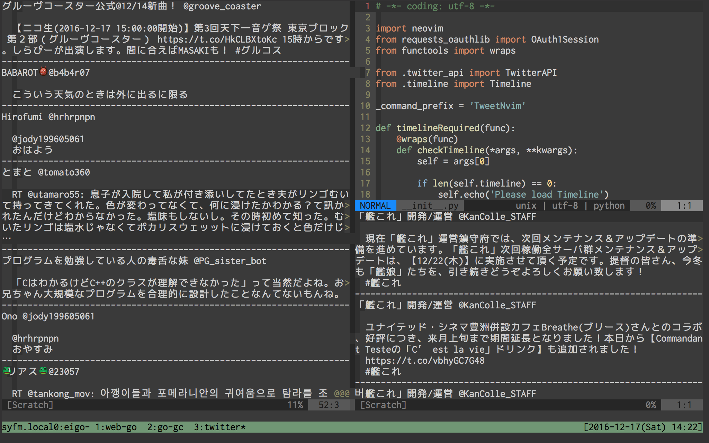

# Tweet.nvim
[](LICENSE)  
[English](./README.md) | [日本語](./README-ja.md)  

Python3 で実装された Neovim 上で動作するシンプルな Twitter クライアント。  

  

===

## 必要なもの
- Python3
- pip3

## インストール
vim-plug
``` sh
Plug 'lycoris0731/tweet.nvim', { 'do': 'make' }
```

プラグインのインストール時に `make` が実行されます。  
その時、tweet.nvim は依存関係を `pip3` を利用してインストールします。  

## セットアップ
このプラグインを使うためには、いくつかの環境変数をセットする必要があります。  
Twitter Apps の登録は [https://apps.twitter.com/](https://apps.twitter.com/) からアクセスできます。  
``` sh
export TWEET_NVIM_CONSUMER=''
export TWEET_NVIM_CONSUMER_SECRET=''
export TWEET_NVIM_ACCESS_TOKEN=''
export TWEET_NVIM_ACCESS_TOKEN_PRIVATE=''
```

## 使い方
```
:TweetNvimHomeTimeline
```
ホームタイムラインを表示します。  
すでに開かれている場合、最新のツイートを取得し、表示します。  

```
:TweetNvimMentionsTimeline
```
自分へのメンションのみを含むタイムラインを表示します。  
すでに開かれている場合、最新のツイートを取得し、表示します。  

```
:TweetNvimShowLists
```
リストの一覧を表示します。  

```
:TweetNvimTimeline name
```
`name` に対応するリストのタイムラインを表示します。  
すでに開かれている場合、最新のツイートを取得し、表示します。  

``` 
:TweetNvimTweet [line...]
```
引数を元にツイートをします。  
各引数は改行で区切られます。  

```
:TweetNvimRetweet 
```
Neovim のカーソル上にあるツイートをリツイートします。  

```
:TweetNvimLike
```
Neovim のカーソル上にあるツイートをいいねします。

```
:TweetNvimReply [line...]
```
Neovim のカーソル上にあるツイートへ返信をします。

## License
Please see LICENSE.
